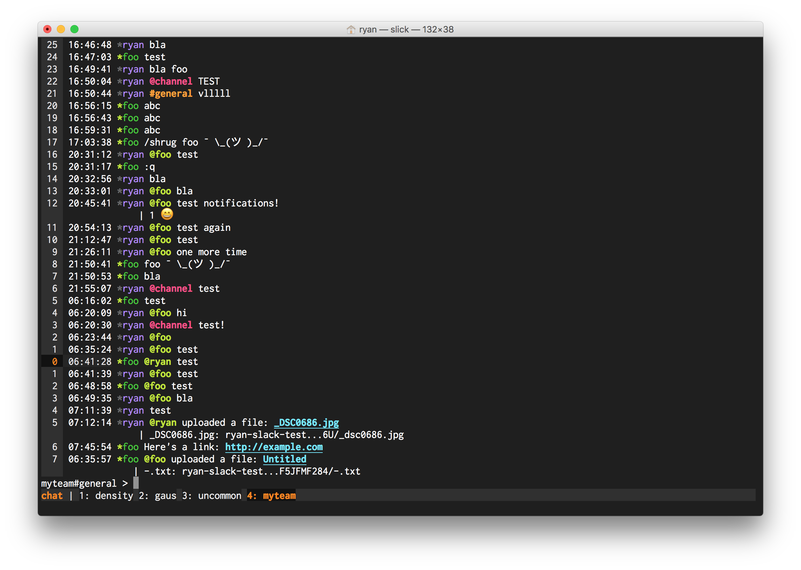

# Color Schemes

Here are a few good looking color schemes to start with, if looking for a place to start:

## Monokai



```lua
Set("Message.SelectedColor", "white:#272822:")

Set("Message.Part.AtMentionUserColor", "#A6E22E::B") -- Green
Set("Message.Part.AtMentionGroupColor", "#F92672::B") -- Magenta
Set("Message.Part.ChannelColor", "#FD971F::B") -- Orange
Set("Message.Part.LinkColor", "#66D9EF::BU") -- Cyan

Set("Message.Sender.OnlinePrefixColor", "#A6E22E::B")
Set("Message.Sender.OfflinePrefixColor", "#303030::B")

Set("StatusBar.Color", "white:#303030:")
Set("StatusBar.ActiveConnectionColor", "#FD971F:#121212:B")
Set("StatusBar.GatewayConnectedColor", "white::")
Set("StatusBar.GatewayConnectingColor", "#FD971F::B")
Set("StatusBar.GatewayFailedColor", "#F92672::B")

-- Switch color of mode: chat is orange, writ is green, pick is cyan
Set("StatusBar.ModeColor", "#FD971F:#303030:B")
onevent('modechange', function(opts)
  if opts.to == "chat" then
    Set("StatusBar.ModeColor", "#FD971F:#303030:B")
  elseif opts.to == "writ" then
    Set("StatusBar.ModeColor", "#A6E22E:#303030:B")
  elseif opts.to == "pick" then
    Set("StatusBar.ModeColor", "#66D9EF:#303030:B")
  end
end)

-- If line numbers are desired:
Set("Message.RelativeLine", "true")
Set("Message.LineNumber.Color", "white:#303030:")
Set("Message.LineNumber.ActiveColor", "#FD971F:#121212:")
```
