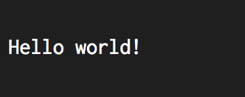

# Colors

Slick uses colors extensively throughout its config to change the appearence of onscreen elements.

## Format

Slick's color format consists of three colon-seperated parts:

`FOREGROUND:BACKGROUND:FORMAT`

### `FOREGROUND` / `BACKGROUND`

Both `FOREGROUND` and `BACKGROUND` are colors. These can either be colors from css (`red` / `green`
/ `lemonchiffon`) or 6-digit hex codes, with a prefixed hash sign (`#FF0000`). Three digit hex codes
aren't supported.

`FOREGROUND` adjusts the text color of the given element. `BACKGROUND` adjust the background color
of the element. Both are optional in the format string, and if not specified, the default foreground
color (usually white) and the default background color (usually black) will take precedence.

### `FORMAT`

`FORMAT` contains a number of flags used to change the format of a given element.

- `B`: Bold
- `U`: Underline

## Examples

- `red:green:` - foreground color of red, background color of green, and no formatting.

- `teal::B` - foreground color of teal, no background color, and bold 

- `:#FF0000:` - background of `#FF0000`

- `::` - Apply no styles and fall back to the defaults.

