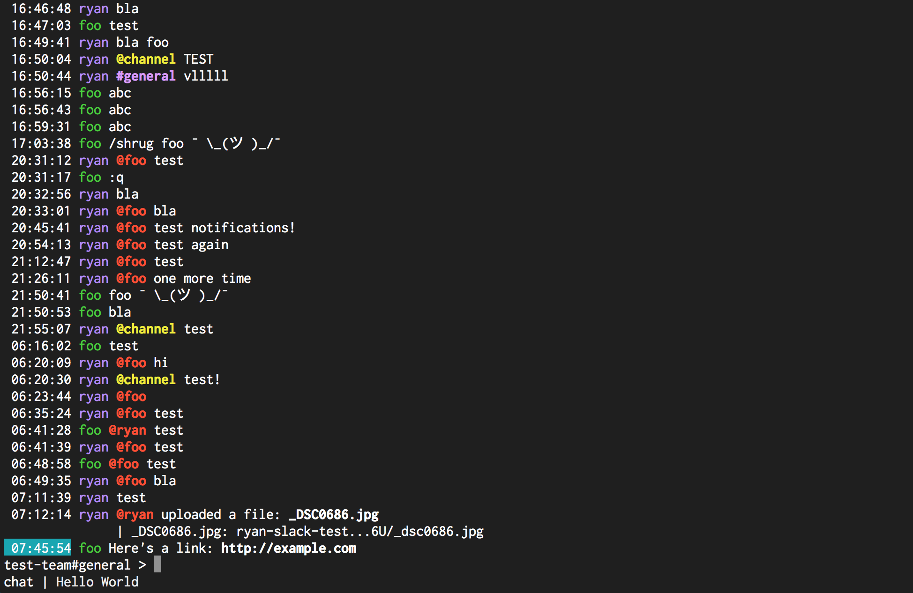
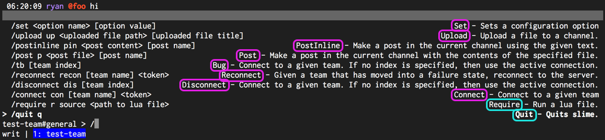

# Commands

Just like vim, slime has an expressive scripting system to help make the app better. Slime uses
[lua](www.lua.org), a common embeddable scripting language. This means that many highter level
changes--adding commands, logging output, and even macros--are easy to create without rebuilding
slime.

## .slimerc
Similar to other apps, slime has a *r*untime *c*onfiguration file. When slime starts, it looks in
your current directory for a `.slimerc`, and slowly walks back up to `/`, looking for a `.slimerc`
at each level. If one is found, it is executed. Finally, it will try to run a `.slimerc` in your
home folder, ie, `~/.slimerc`.

## Lua example
Within any of those `.slimerc` files, you can write lua and slime will execute it on startup:

```bash
$ echo 'print("Hello world!")' > ~/.slimerc
$ slime
```



# Helper functions

What you saw above--the use of `print--is a helper function. To allow lua to effect slime, a number
of functions have been defined to allow lua to effectively call into slime and slime call into lua.
Here are a number of them:

- `print` / `error` / `clear`: Log to the bottom bar, log to the bottom bar as an error, and clear
  the status bar of logs. Example: `print("Hello world")` / `error("Oh no!")` / `clear()`
- `getenv`: Fetch the contents of an environment variable. Returns a string. Example:
  `getenv("HOME")` returns `"/home/ryan"`.
- `shell`: Run a given shell command and return the output as a string. Example: `shell("date")`
  returns `"Thu May 25 06:31:14 EDT 2017"`.
- `sendmessage`: Within the selected conenction and selected channel, send a message. Example:
  `sendmessage("@foo Hello foo!")`.

- `keymap`: Bind a set key combination to a function. This is one of the major ways that code is
  "kicked off later" in lua. Example:
```lua
keymap("qq", function()
	print("Hello world!")
end)
```

Now, when a user presses `qq`, "Hello world!" is logged to the status bar.

- `command`: Create a new slash command. Example:
```lua
command("mycommand", "Command Description", "<arg1>", function(args)
	print("mycommand: "..args[2])
end)
```

Now, when a user runs `/mycommand foo`, "mycommand: foo" is logged to the status bar.

You may be wondering, what's in `args`? `args` is an table of strings. In lua, tables are 1-indexed,
so `args[2]` is actually the second item. `args[1]` is always the name of the command, ie in the
above it would be `mycommand`. All arguments after the first argument are the arguments passed to
the command. For example, `/mycommand foo` would have an arguments table of `["mycommand", "foo"]`.

# Commands
Any command that is available inside the editor can be run from lua. A list is available in
[`commands.go`](https://github.com/1egoman/slime/blob/master/commands.go), inside of the `COMMANDS`
constant.

For example, let's say we want to connect to a new slack team. `Connect` can do this. Typically,
you'd run `/connect "Team Name" slack-token-here` to connect to a new team, but instead, we can do
this from lua:

```lua
Connect("Team Name", "slack-token-here")
```

As a rule of thumb, the lua function is the pascal-case varient of the command that you'd type.



In the above, a number of command names are highlighted in the fuzzy picker. The magenta ones (among
others) can be run in lua. The cyan commands are notable exceptions and cannot:
- `Quit`: It's impossible to close slime from lua.
- `Require`: The builtin `require` does the same thing, so it's unnecessary.

# Including other scripts
Lua has a `require` function that can load in other scripts. For example:
```
-- foo.lua
print("Hello world!")
-- .slimerc
require("./foo")
```

On startup, `Hello world` is logged to the status bar.

## Interactively
Especially when testing something, it can be helpful to interatively load in a script. The `Require`
command does this from within the editor. Just run `/require bar.lua` to load in and execute a
script.

# Modules
We've added a few modules that can be loaded in by lua to run more powerful tasks:

- `http`: [Gluahttp](https://github.com/cjoudrey/gluahttp) is available with `require("http")`.
