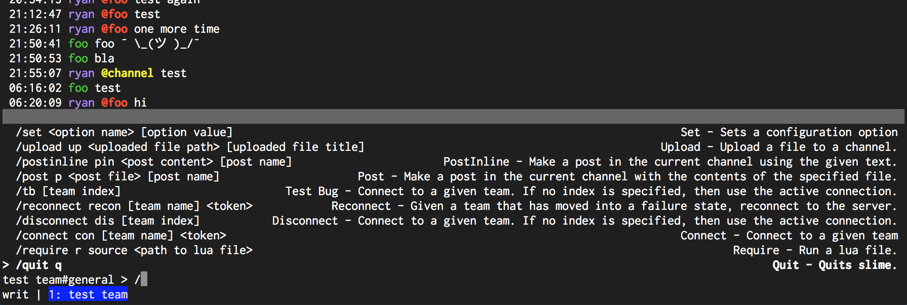

# Commands

When in [`write` mode](Modes.md), the user can send messages as well as send commands. To start
executing a command, type `/`:

As you continue to type, the command list will filter to the command you're typing and give a hint
about its syntax. Once done typing the command, press `enter`:

(Learn about [PostInline](commands/PostInline.md))

## Styling
- [CommandBar.PrefixColor](configuration/CommandBar.PrefixColor.md)
- [CommandBar.TextColor](configuration/CommandBar.TextColor.md)
