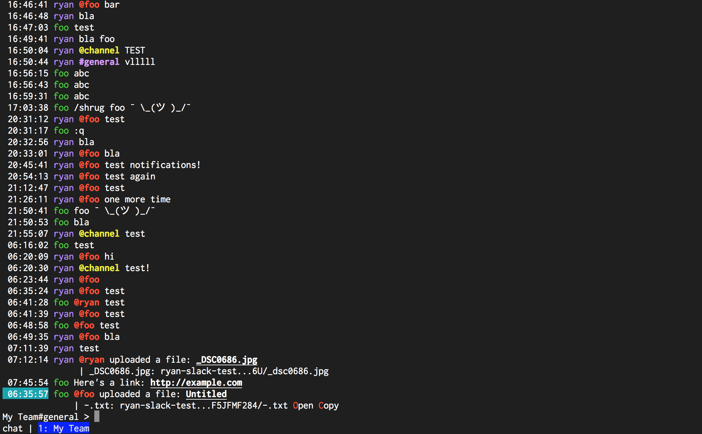

# Connecting to a Slack team

1. Go to [api.slack.com/custom-integrations/legacy-tokens](https://api.slack.com/custom-integrations/legacy-tokens), and generate a token for the team you'd like to add to slime.

2. Once you have a token, edit your [`~/.slimerc`](Scripting.md#slimerc) file, and add a single line:

```lua
Connect("My Team", "slack-token")
```

The [Connect](commands/Connect.md) function takes two parameters: a team name and a slack token.
Feel free to adjust the team name, specify your slack token as the second parameter.

3. Start slime. Depending on the size of the team it [may take a few seconds](MessageCaching.md) but
   eventually, slime will fully connect:


