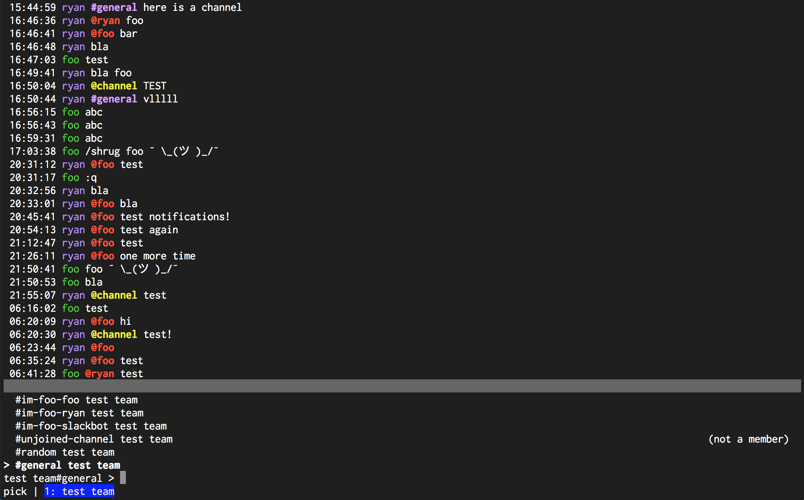

# Modes

Just like vim or emacs, slick is modal. Slick either operates in `chat` mode (the default), `write`
mode, or `pick` mode. The current mode is visible in the bottom left corner of the screen:

Within any mode, press `esc` to go back to `chat` mode.

# `chat` mode

This is the default mode that slick starts in.

- `j/k`: move up and down through messages. Prefix with a number to move faster, ie, `5j`.
- `Ctrl-u/Ctrl-d`: move through messages by page. The speed [is configurable](configuration/Message.PageAmount.md).
- `gg`: Move to the topmost message in the channel (the oldest). If there are more messages further back in the
  channel's history, start loading them.
- `G`: Move to the bottommost message (the most recent).
- `zz`: Attempt to center the screen on the given message.
- `Ctrl-z/Ctrl-x`: Move to the next or previous connection in the list in the status bar.

- `w` or `/` or `:`: Move to `write` mode. `/` and `:` will move into `write` mode with the
  respective character as the start of the command.
- `p`: Move to `pick` mode.

# `write` mode

In `write` mode, you're typing a message to be sent or a command to be processed. Therefore, there
aren't very many shortcuts, since the keyboard is being used to enter text.

- Arrow keys, or `Ctrl-h/Ctrl-l`: Move the cursor within the message.
- `Ctrl-a/Ctrl-e`: Move the cursor to the start of the line or the end of the message.
- `Ctrl-w`: Delete a word.
- `Enter`: Send a message or process a command.

# `pick` mode

In `pick` mode, you're choosing a new connection and channel to jump to.

- Typing fuzzy-searches through the list of conenctions and channels.
- Arrow keys, or `Ctrl-j/Ctrl-k`: Change the selected item in the channel picker.
- `Enter`: Pick a connection and channel, then switch to it.
