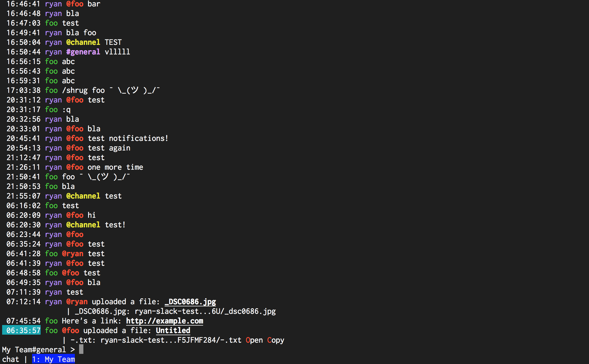

# Getting Started

Slick is a slack client for the terminal. It supports a significant subset of slack's features,
including multiple teams (we call them connections), post &amp; attachments, and an api in lua that
allows for nearly infinite customization.

## Installing
Learn more [here](Installing.md). TL;DR: [Download the latest release](https://github.com/1egoman/slick/releases).

## Usage
- [Connecting to Slack team](Connecting.md) - Do this first!
- [Modes](Modes.md)
- [Commands](Commands.md)
- [Messages](Messages.md)
- [Actions](Actions.md)

## Configuring
- [Scripting](Scripting.md)
  - [Color Format](Colors.md)
- [Configuration Parameters](configuration/README.md)
