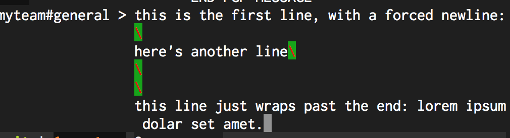

# CommandBar.NewLineColor

- Type: `color`
- Default: `gray::B` [(format explanation)](../Colors.md)

This configuration option specifies the color of the new line character appended to the message when
the user adds a newline to a message that is sent.

It's added to help the user distinguish between a line that wrapped (ie, the line's length is over
the width of the app) and a forced newline.

## Usage
`:set CommandBar.NewLineColor red:green:`

