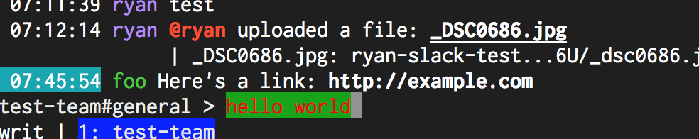

# CommandBar.TextColor

- Type: `color`
- Default: `::` [(format explanation)](../colors.md)

This configuration option specifies the style for the command bar input text.

## Usage
`:set CommandBar.TextColor red:green:`

