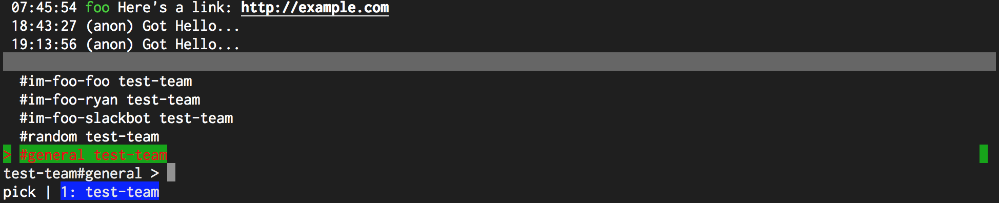

# FuzzyPicker.ActiveItemColor

- Type: `color`
- Default: `::B` [(format explanation)](../Colors.md)

This configuration parameter specifies the color of the active item chosen in the fuzzy picker.

## Usage
`:set FuzzyPicker.ActiveItemColor red:green:`

