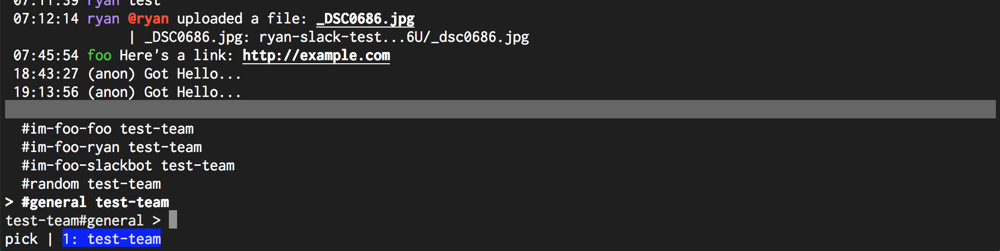

# FuzzyPicker.TopBorderColor

- Type: `color`
- Default: `:gray:` [(format explanation)](../colors.md)

This option specifies the style of the border on top of the fuzzy picker.

## Usage
`:set FuzzyPicker.TopBorderColor red:green:`

