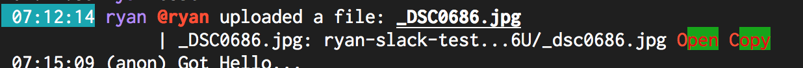

# Message.Action.Color

- Type: `color`
- Default: `::` [(format explanation)](../Colors.md)

This configuration option specifies the color of the non-highlighted part of a action.

## Usage
`:set Message.Action.Color red:green:`

