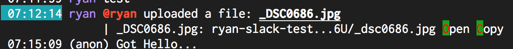

# Message.Action.HighlightColor

- Type: `color`
- Default: `red::` [(format explanation)](../Colors.md)

This configuration option specifies the color of the highlighted (the keyboard action) part of an action.

## Usage
`:set Message.Action.HighlightColor red:green:`

