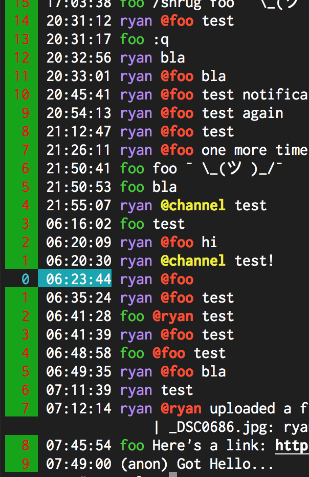

# Message.LineNumber.Color

- Type: `color`
- Default: `white::` [(format explanation)](../colors.md)

This configuration option specifies the style used to render non-selected line numbers, if the
[`Message.RelativeLine`](Message.RelativeLine.md) configuration is set.

## Usage
`:set Message.RelativeLine true`
`:set Message.LineNumber.Color red:green:`

