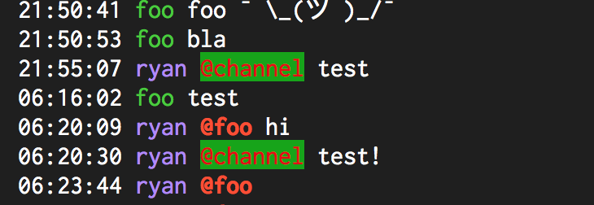

# Message.Part.AtMentionGroupColor

- Type: `color`
- Default: `yellow::B` [(format explanation)](../colors.md)

This configuration option specifies the style of `@mentions` toward groups, such as `@channel`,
`@everyone` and `@here`.

## Usage
`:set Message.Part.AtMentionGroupColor red:green:`

