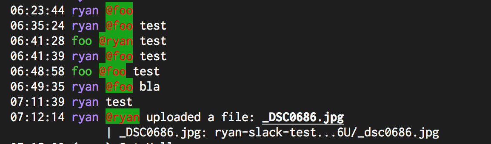

# Message.Part.AtMentionUserColor

- Type: `color`
- Default: `red::B` [(format explanation)](../colors.md)

This configuration option specifies the style used to render `@mentions` toward other users.

## Usage
`:set Message.Part.AtMentionUserColor red:green:`

