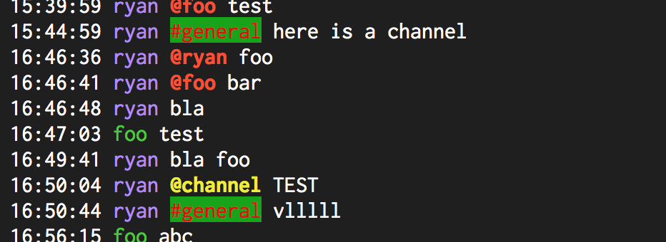

# Message.Part.ChannelColor

- Type: `color`
- Default: `blue::B` [(format explanation)](../colors.md)

This configuration option specifies the style used to render `#channel`s within a message, like
`#general` or `#random`.

## Usage
`:set Message.Part.ChannelColor red:green:`

