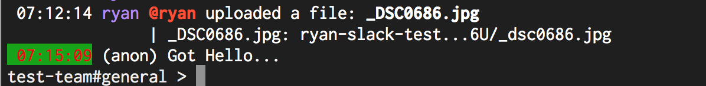

# Message.SelectedColor

- Type: `color`
- Default: `:teal:` [(format explanation)](../Colors.md)

This configuration option specifies the color of the timestamp on a selected message.

## Usage
`:set Message.SelectedColor red:green:`

