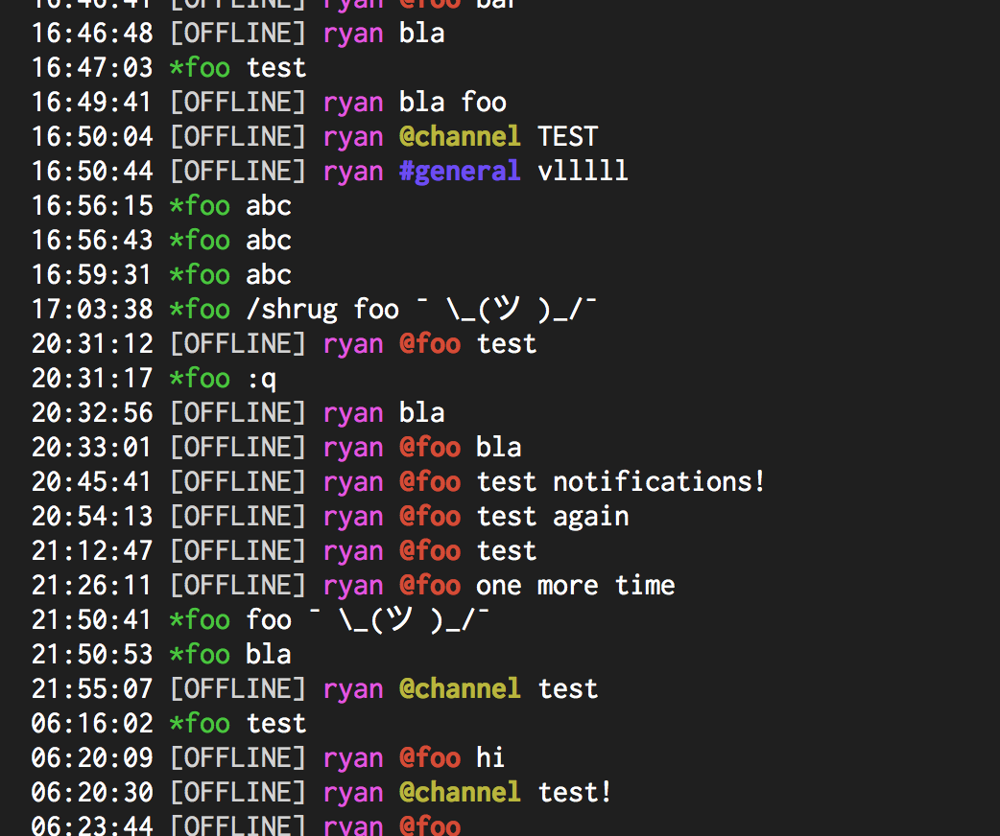

# Message.Sender.OfflinePrefix

- Type: `string`
- Default: `*`

Specifies the prefix to put before a user when a user is offline. Set to an empty string (`""`) to
disable.

## Usage
`:set Message.Sender.OfflinePrefix "[OFFLINE] "`

