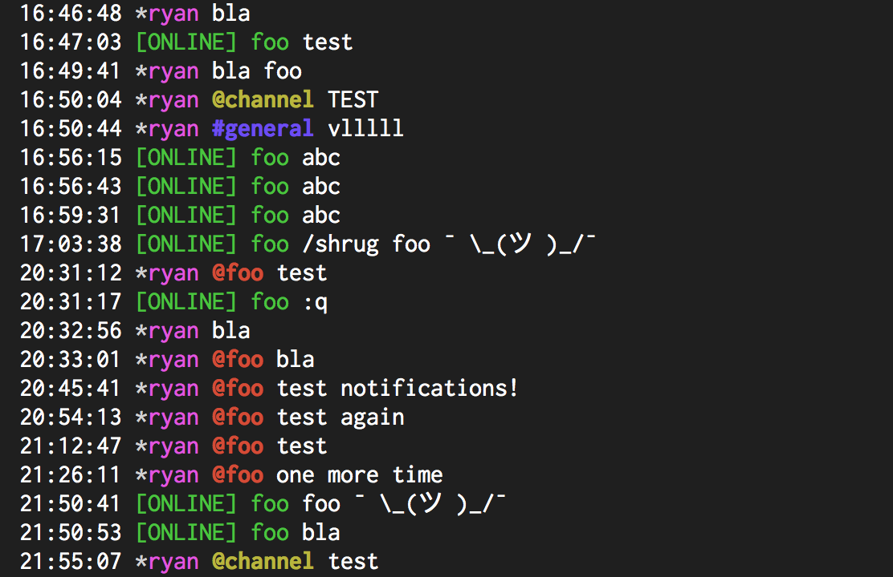

# Message.Sender.OnlinePrefix

- Type: `string`
- Default: `*`

Specifies the prefix to put before a user when a user is online. Set to an empty string (`""`) to
disable.

## Usage
`:set Message.Sender.OnlinePrefix "[ONLINE] "`

