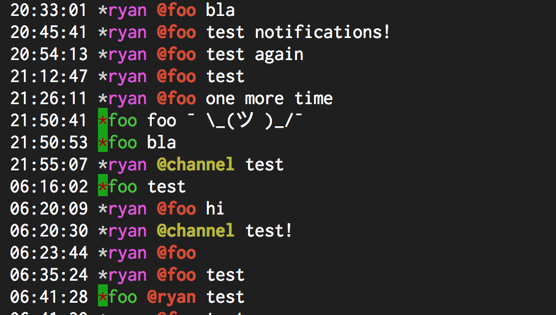

# Message.Sender.OnlinePrefixColor

- Type: `color`
- Default: `green::` [(format explanation)](../Colors.md)

This configuration option specifies the color to render the user prefix if a given user is
online.

## Usage
`:set Message.Sender.OnlinePrefixColor red:green:`

