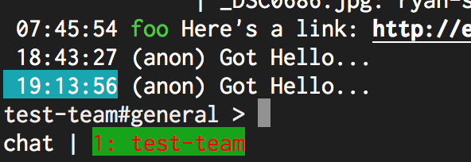

# StatusBar.ActiveConnectionColor

- Type: `color`
- Default: `white:blue:` [(format explanation)](../colors.md)

This configuration option defines how a the active connection will be rendered on the status bar.

## Usage
`:set StatusBar.ActiveConnectionColor red:green:`

