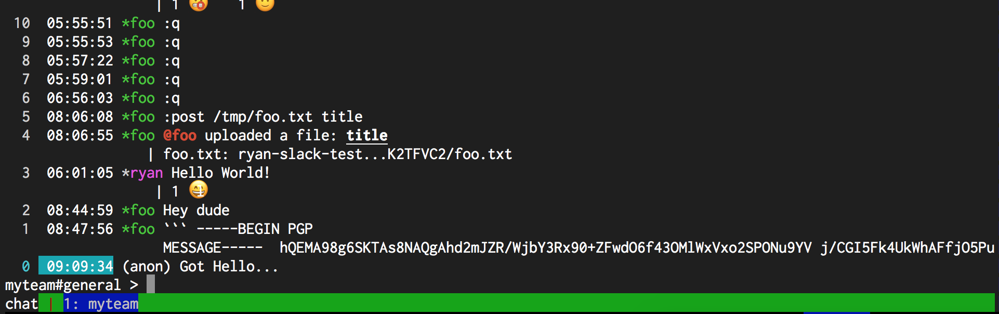

# StatusBar.DefaultColor

- Type: `color`
- Default: `::` [(format explanation)](../Colors.md)

This option specifies the default color of the status bar - ie, the color of the parts of the status
bar that aren't colored by other configuration options.

## Usage
`:set StatusBar.DefaultColor red:green:`

