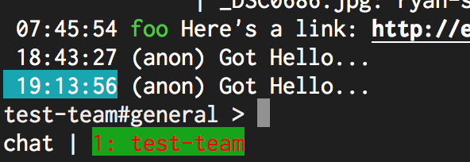

# StatusBar.GatewayConnectingColor

- Type: `color`
- Default: `darkmagenta::` [(format explanation)](../Colors.md)

As a connection initially connects, it's rendered differently to distinguish it's not fully
initialized. This option specifies the rendering style for the connection in the status bar while
still connecting.

## Usage
`:set StatusBar.GatewayConnectingColor red:green:`

