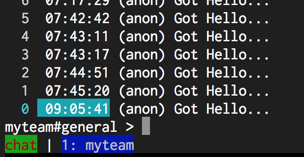

# StatusBar.ModeColor

- Type: `color`
- Default: `::` [(format explanation)](../Colors.md)

This option specifies the color of the mode text on the status bar.

## Usage
`:set StatusBar.ModeColor red:green:`

