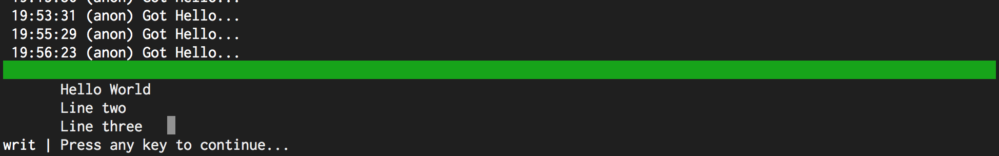

# StatusBar.TopBorderColor

- Type: `color`
- Default: `:gray:` [(format explanation)](../Colors.md)

This option specifies the style of the border on top of the log output when the log output is
multiline.

## Usage
`:set StatusBar.TopBorderColor red:green:`

